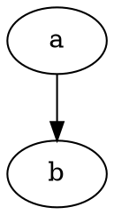
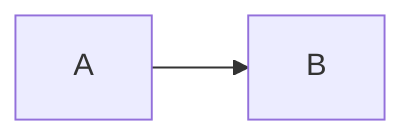

# Slidr slide creation

Create markdown presentations for slidr (markdown to styled HTML slides with PDF output).

## Quick start

Generate a `.md` file and build with `pdm run slidr file.md`. Slides are separated
by `---` on its own line. The first YAML frontmatter block sets global options.

## Frontmatter

```yaml
---
theme: default
title: My Talk
footer: "Conference 2026"
paginate: true
size: 16:9              # 16:9 | 4:3 | 16:10
logo: ./logo.png
pygments_style: monokai # any style from pygments-styles.org
style: |
  .custom { color: red; }
---
```

## Slide directives

Place directives on their own line at the top of a slide body:

| Directive | Effect |
|-----------|--------|
| `@kicker text` | Title slide eyebrow, monospace accent |
| `@subtitle text` | Title slide subtitle |
| `@speaker name=X role=Y` | Title slide attribution with optional role |
| `@layout name` | Apply slide layout (see below) |
| `@col` | Explicit column break within `two-col` layout |
| `@tiny text` | Small dimmed annotation |

## Slide types

Every slide is one of these. Most are auto-detected from content; `@layout <name>`
forces one. Detection order: h1/kicker/speaker -> `title`; a grid of all-`{metric}`
cards -> `metrics-N`; any grid -> `grid-N`; otherwise `content`.

| Type | Auto-detected by | Force with |
|------|------------------|-----------|
| [Title](#title) | h1, `@kicker`, or `@speaker` | `@layout title` |
| [Metrics](#metrics) | grid of `{metric}` cards | `@layout metrics` |
| [Grid and cards](#grid-and-cards) | `::: grid {cols=N}` or 2+ adjacent cards | - |
| [Content](#content) | anything else | `@layout content` |
| [Two-column](#two-column) | - | `@layout two-col` |
| [Image](#image) | - | `@layout image-left` / `image-right` |
| [Compare](#compare) | - | `@layout compare` |
| [Ecosystem](#ecosystem) | - | `@layout ecosystem` |

Block grammar (`::: grid`, `::: card`, tags, `{icon:...}`, fenced diagrams) is in
[Block syntax](#block-syntax); the snippets below only show how each type composes it.

### Title

Opening slide. Auto-detected: any h1, `@kicker`, or `@speaker` makes the slide a title.

````markdown
@variant dark
@kicker Open Source Summit Korea 2026
# Simplifying AI for Edge Compute with HAMi

@subtitle Slicing one device, running many agents

@speaker name="Reza Jelveh" role="Solution Architect, Dynamia AI" github=github.com/fishman
````

`@variant dark` flips the slide to the theme's dark palette. `@side-image <path>`
pins an image to the corner (typical on title and closing slides).

### Section divider

No separate type: a divider is a title slide with an h1 and a subtitle. Any h1
triggers `title` layout, so `## ` would not work here.

````markdown
# Part 2: The Solution

@subtitle One scheduling plane across heterogeneous accelerators
````

### Content

The default. h2 heading, optional `@subtitle`, then bullets, prose, cards, or any mix.

````markdown
@layout image-right

## The Problem

@subtitle One GPU per task is the default

Kubernetes allocates GPUs atomically: one whole device, one task.

- A 1 GB task blocks an 80 GB device
- Most GPUs sit idle most of the time


````

Title the slide with `## `, not `# `: an h1 switches the slide to [Title](#title).

### Grid and cards

Two or more adjacent `::: card` blocks auto-group into a grid. Wrap in
`::: grid {cols=N}` to pin the column count or add a class; without it, cards are
laid out at the count you wrote.

````markdown
::: grid {cols=3}
::: card {tag=green}
### {icon:scan cls=accent-secondary} CV and classic inference

- YOLO, classification, OCR, embeddings
- 1-50M params, millisecond latency
:::
::: card {tag=cyan}
### {icon:message-square cls=accent-primary} LLMs

- Autoregressive text generation
- Weights plus KV cache in memory
:::
:::
````

Cards take nested content: fenced code, lists, images, and nested grids. Tags are
`green`, `cyan`, `yellow`, `red`. Omit a tag for the default card style.

### Metrics

A row of big-number cards. Consecutive `::: card {metric}` blocks auto-group and
detect as `metrics-N`. The first line is the value, the rest is the label.

````markdown
@layout metrics
## Where HAMi Is Today

@subtitle Production metrics from CNCF case studies

::: grid {cols=4}
::: card {metric}
4x
GPU utilization: 5-10% to 30-50%
NIO
:::
::: card {metric}
90%
GPU infra managed by HAMi on RTX 4070/4090
Prep Edu
:::
:::

@row

::: notes{ tag="green" }
Source: [cncf.io/case-studies](https://www.cncf.io/case-studies/)
:::
````

`@row` groups everything after it into one horizontal band, used here to put the
source notes under the metric grid. Without `@layout metrics` the slide gets
`metrics-N`, which centers the grid vertically.

### Two-column

Heading spans full width; body splits at `@col`. Without `@col` the split falls
after the first block.

````markdown
@layout two-col

## GPU Sharing

@subtitle Dynamic fine-grained device slicing

- **NVIDIA, Ascend, Cambricon** supported
- **Fine-grained:** as small as 1MB memory, 1% cores
- **Transparent to tasks:** no code changes required

@col

```yaml
resources:
  limits:
    nvidia.com/gpumem: 3000
```
````

`@col` also works inside `image-left` / `image-right`, where it overrides the
automatic image split.

### Image

Text on one side, image on the other. Split at the first image in the slide, or at
`@col` when present. Use `@layout image-right` for text-left/image-right,
`image-left` for the reverse.

````markdown
@layout image-right

## Scheduling Policies

@subtitle Binpack & Spread


- **Node binpack** frees whole machines
- **Node spread** isolates faults
````

The image is lifted out of the body flow into its own column, so its position in the
markdown does not matter as much as which image comes first.

### Compare

Card, arrow, card. The arrow is an `::: arrow` fence; a `::: notes` fence after it
renders as a footer.

````markdown
@layout compare

## The GPU Challenge

@subtitle What breaks, what HAMi needs to solve

::: card {tag=compare}
### Problem

- GPUs are scarce, allocated whole
- Utilization stuck at 10%
:::

::: arrow

{icon:arrow-right cls=accent-primary size=48}
:::

::: card {tag=compare}
### Requirements

- Hardware agnostic: one API, any accelerator
- Fractional GPU: fine-grained slices
:::

::: notes{ tag="green" }
Optional footer line.
:::
````

The layout splits on the `::: arrow` node, so exactly one arrow goes between the two
cards. An arrow with no content renders a default right arrow.

### Ecosystem

Compact stacked sections for logo walls and adoption stats: small h3 labels, tight
card padding, uniform inline images that wrap naturally.

````markdown
@layout ecosystem
## Community & Adopters

@subtitle Devices, integrations, and who uses HAMi

#### Open Source, CNCF Backed

::: grid {cols=5}
::: card {metric}
5.2k
Github Stars
:::
::: card
 
:::
:::

#### Ecosystem & Device Support

::: card
 
:::
````

Paragraphs holding only images dissolve so the images flow inline and wrap. Keep
logos at a consistent aspect ratio, since they are normalized to the same height.

### Table

Pipe tables become `<table>` with a header row. Inline markdown works in cells, and
`{icon:...}` is a compact way to show yes/no.

````markdown
## GPU Sharing Approaches

| Capability | MIG | HAMi | NVIDIA DRA |
|------------|:---:|:---:|:---:|
| Sub-MIG slicing | {icon:x cls=accent-secondary} | {icon:check cls=accent-primary} | {icon:x cls=accent-secondary} |
| Multi-vendor | {icon:x cls=accent-secondary} | {icon:check cls=accent-primary} | {icon:x cls=accent-secondary} |
````

### Quote and code

`>` renders as a `.quote` block; a fenced block with a language renders
syntax-highlighted via `pygments_style`. A bare fence is plain `<pre>`.

````markdown
> GPUs are the most expensive resource in the cluster.

```python
devices = nvmlDeviceGetCount()
```
````

### Video

`@video <path>` embeds a player. In PDF output it degrades to a frame, so pair it
with a subtitle that stands on its own.

````markdown
## Demo

@subtitle 3 nodes x 2 A100s: MIG, YOLO, and two vLLMs

@video assets/demo/llm_test.mp4
````

### Body directives

Per-slide, placed anywhere in the slide body. `@layout`, `@variant`, and
`@transition` are consumed by the parser; the rest become AST nodes.

| Directive | Effect |
|-----------|--------|
| `@variant dark` | Use the theme's dark palette for this slide |
| `@transition <name>` | Override the frontmatter transition for this slide |
| `@hidden` / `@hide` | Drop the slide from output (kept in source) |
| `@row` | Group following content into a horizontal band |
| `@side-image <path>` | Corner image, does not affect row sizing |
| `@video <path>` | Inline video player |
| `@tiny <text>` | Small dimmed annotation |

Custom layouts: `@layout <name>` adds CSS class `layout-<name>`, style via the
`style:` frontmatter block.

## Slide transitions

Set per-slide or as frontmatter default:

```yaml
---
transition: fade
---
```

```markdown
@transition slide
```

Available: `fade`, `slide`, `zoom`, `flip`, `wipe`. All 0.4s, incoming-only.

## Block syntax

```
::: grid {cols=2}             # auto-detected as grid-2 layout
::: card                       # basic card with border-radius
::: card {tag=green}           # colored card: green, cyan, yellow, red
::: card {metric}              # big number + label, auto-grids
::: card {side-image}          # centered, no chrome, doesn't affect row sizing
> quote text                   # blockquote, renders as .quote div
| col1 | col2 | col3 |         # pipe table with header row
```seaborn                     # matplotlib/seaborn chart rendered at build time
```dot                         # Graphviz diagram, injected with theme colors
```mermaid                     # Mermaid CLI diagram, SVG output
```language                    # generic code block, syntax highlighted
{icon:star cls=accent-primary} # lucide icon, inline SVG
```

Cards support nested content: fenced code blocks (` ```seaborn`), nested grids
(`::: grid`), lists (`- item`), and images. Markdown inline formatting works
inside cards via `_expand_markdown`.

## Fenced diagrams

### Seaborn / matplotlib

Code block executes in-process, returns SVG:

````markdown
```seaborn
import matplotlib.pyplot as plt
fig, ax = plt.subplots()
ax.barh(0, 70, color="#22c55e")
```
````

Theme colors available via rcParams: `plt.rcParams["axes.facecolor"]`,
`"text.color"`, `"axes.edgecolor"`, `"xtick.color"`. Requires `seaborn` +
`matplotlib` (install via `pdm install -G plot` or `slidr[plot]`).

### Graphviz

````markdown

````

Theme CSS variables available: `--color-card-bg` → bgcolor, `--color-foreground`
→ fontcolor, `--color-accent` → edgecolor.

### Mermaid

````markdown

````

Requires `mermaidx` / Mermaid CLI installed.

## Lucide icons

```markdown
{icon:check cls=accent-primary}
{icon:x cls=accent-secondary}
{icon:star stroke=#f0f}
```

Works in body text, card headers, list items, tables. Uses inline SVG.

## Layout caveats

`@col` works in all column layouts (`two-col`, `image-right`, `image-left`).
When present, overrides auto-detection.

## Speaker notes

## Theme creation

Create a `.css` file with CSS custom properties and visual rules. The theme is
loaded after `base.css` (which handles layout, positioning, spacing). Themes
should only define colors, fonts, and visual decoration.

### Theme template

```css
/* Theme name */

:root {
  --color-background: #fff;
  --color-background-stripe: #f5f5f5;
  --color-foreground: #333;
  --color-dimmed: #777;
  --color-accent: #0288d1;
  --color-accent-bg: rgba(2, 136, 209, 0.1);
  --color-border: #ddd;
}

section {
  background: var(--color-background);
  color: var(--color-foreground);
  font-family: "Segoe UI", "Helvetica Neue", Arial, sans-serif;
}

h1, h2, h3, h4, h5, h6 { color: var(--color-foreground); }
h1 { font-size: 2.5em; }
h2 { font-size: 1.8em; }
h3 { font-size: 1.3em; }
h4 { font-size: 0.85em; }

--title-h1-size: 3.5em;        /* title slide h1, theme-configurable */
--title-subtitle-size: 1.8em;  /* title slide subtitle */

code { background: rgba(0,0,0,0.05); font-family: monospace; }
pre { background: rgba(0,0,0,0.05); }

blockquote { border-left-color: var(--color-accent); color: var(--color-dimmed); }
th { background: var(--color-accent-bg); color: var(--color-foreground); }
th, td { border: 1px solid var(--color-border); }
tr:nth-child(even) { background: var(--color-background-stripe); }

a { color: var(--color-accent); }
.card { background: rgba(0,0,0,0.15); border: 1px solid var(--color-border); }
.quote { border-left-color: var(--color-accent); }
.kicker { color: var(--color-accent); }
.speaker .role { color: var(--color-dimmed); }
footer, .slide-num { color: var(--color-dimmed); }
.subtitle, .tiny, .muted { color: var(--color-dimmed); }

.tag-green { border-color: #0fd05d; }
.tag-cyan  { border-color: #67d8ff; }
.tag-yellow { border-color: #ffd166; }
.tag-red   { border-color: #ff7a7a; }
```

Apply via: `pdm run slidr slides.md --theme ./my-theme.css` or reference by filename
in frontmatter: `theme: my-theme`.

## Reference

See `examples/features_demo.md` for a complete 10-slide deck exercising all features.
See `src/slidr/themes/default.css` for the default theme structure.
